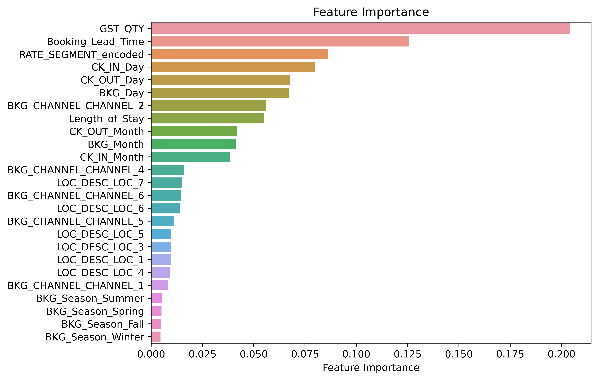
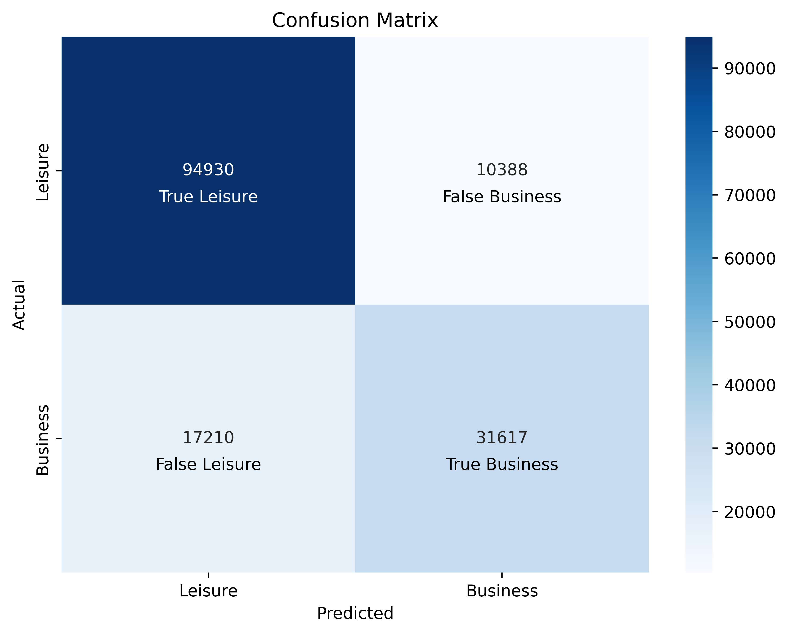
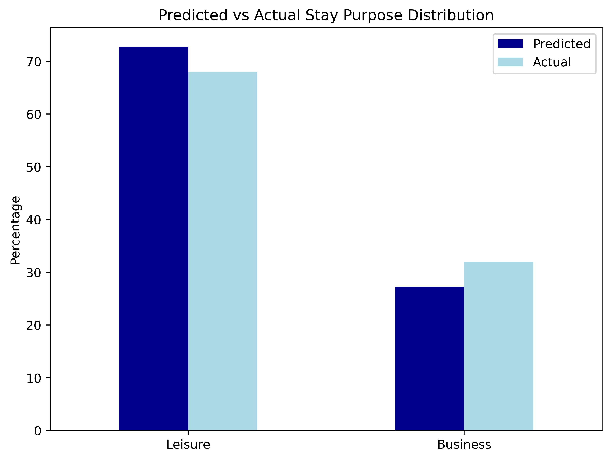

# Hotel Stay Classifier

## Overview
The project aims to build a classification model to determine guests' stay purpose (business vs. leisure) based on booking and stay-related features.

## Dataset
The dataset consists of 516,220 rows (bookings) and 9 columns (stay-related features):

| Column | Definition | 
| --- | --- |
| BKG_DT | date of booking | 
| CK_IN_DT | date of check-in | 
| CK_OUT_DT | date of check-out | 
| LOC_DESC | location description of hotel |
| GST_QTY | number of declared guests | 
| RM_QTY | number of rooms booked | 
| RATE_SEGMENT | room rate segment | 
| BKG_CHANNEL | channel where the booking is made | 
| STY_PURPOSE | stay purpose | 

## Data Cleaning and Transformation
1.	Missing value handling: Evaluated missing values; only location, rate segment, and booking channel had minor missing rates (<1%) and were removed without significantly impact on the overall dataset.
2.	Data type conversion: Converted booking and stay dates to datetime objects for consistency and to facilitate new feature calculations.
3.	Feature engineering: Created new features:
- Length of stay – duration between check-out and check-in
- Booking lead time – interval between check-in and booking dates
- Day of the week – extracted from the booking, check-in, and check-out date to capture seasonal or weekly patterns
- Booking seasonality – months and seasons of booking date to correlate with stay purpose
4.	Categorical encoding – applied a one-hot encoding was applied to categorical variables (location and booking channel) and label encoding for rate segment.
5.	Target variable transformation – converted stay purpose to a binary format (1 for business, 0 for leisure)

## Tech Stack
- Python
- Pandas (data manipulation and cleaning)
- Scikit-learn (machine learning algorithms implementation and model performance evaluation)
- Matplotlib/Seaborn (data visualization)

## Data Splitting
The dataset was split into training (70%) and testing (30%) subsets, ensuring stratification to maintain the class distribution.

## Model Training
Random Forest Classifier was selected for its robustness to class imbalance and ability to handle non-linear relationships since the distribution of business and leisure stays is imbalanced (32: 68) and the dataset contains varying features such as categorical variables, numerical values, and dates. The training dataset was then scaled using StandardScaler to standardize the feature values.

## Model Evaluation
- Feature importance analysis: Guest quantity, booking lead time, and rate segment were among the top features influencing the model's predictions. Features with very low importance are room quantity, location 2, and booking channel 3. To further improve the model, these were removed from the dataset as they are close to zero and have virtually no contribution to the model. The model was then retrained.

- Confusion matrix: The predicted distribution closely aligns with the desired distribution (Leisure: 72.81% vs. 68%; Business: 27.19% vs. 32%), reflecting the model’s effectiveness.

- Classification Report: The model performs well with an overall accuracy of 82%, correctly predicting business or leisure stays most of the time. Although the model has strong precision and recall for leisure stays, it has slightly lower performance for business stays.

| | Precision	| Recall | F1-score |
| -- | -- | -- | -- |
| Leisure	| 0.85 | 0.9 | 0.87	|
| Business	| 0.75 | 0.65 | 0.70 |
| Accuracy	| 0.82 |
| Macro average	| 0.8	| 0.77	| 0.78	|
| Weighted average	| 0.82	| 0.82	| 0.82 |

- ROC AUC Score: The model achieved an ROC AUC score of 0.85, indicating good discrimination between stay purposes.
 
## Insights
- The model balanced precision and recall, indicating its effectiveness in correctly classifying stay purposes.
- The model has slightly better performance in predicting leisure than business stays.
- The ROC AUC score demonstrated strong discriminatory ability, suggesting the model can reliably differentiate between business and leisure guests.
o	Class distribution analysis indicated a relatively balanced representation of both target classes, which is crucial for training robust predictive models.
